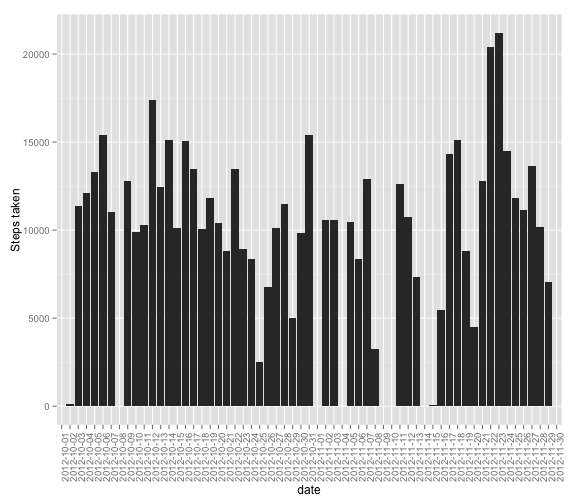
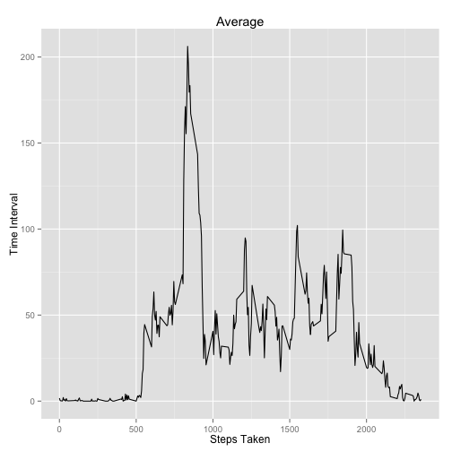
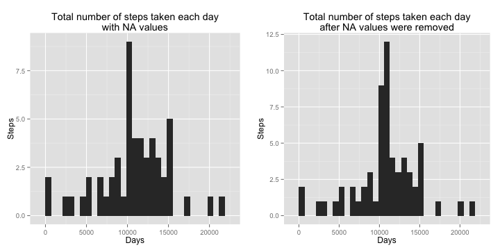
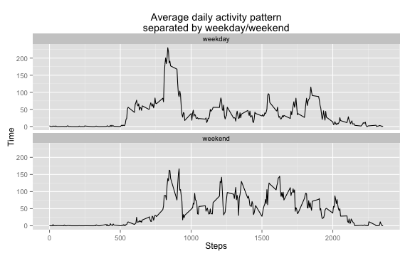

# Reproducible Research: Peer Assessment 1
This report is analysis of the activity performed by an individual during the months of October and November 2012 collected at 5 minutes interval. It will also attempt to answer the various questions asked as mentioned in the assignment here[1];

The data used for analysis resides in the repository together with this markdown and HTML report

## Setup
Package [Dplyr][2] is used to perform group by operations on the data and requires installation. It can be installed by doing 
 


install.packages("dplyr" )


```r
if (!require("dplyr")) {
  install.packages("dplyr", repos="http://cran.rstudio.com/") 
  library("dplyr")
}
```

```
## Warning: package 'dplyr' was built under R version 3.1.2
```

```r
if (!require("ggplot2")) {
  install.packages("ggplot2", repos="http://cran.rstudio.com/") 
  library("ggplot2")
}
if (!require("grid")) {
  install.packages("grid", repos="http://cran.rstudio.com/") 
  library("grid")
}
if (!require("gridExtra")) {
  install.packages("gridExtra", repos="http://cran.rstudio.com/") 
  library("gridExtra")
}
if (!require("xtable")) {
  install.packages("xtable", repos="http://cran.rstudio.com/") 
  library("xtable")
}
```

```
## Warning: package 'xtable' was built under R version 3.1.1
```


## Loading and preprocessing the data

Obtain the data for analysis


```r
unzip("activity.zip")
```
 
Read the CSV 

```r
activity = read.csv("activity.csv")
```

Quick summary of data

```r
summary(activity)
```

```
##      steps                date          interval     
##  Min.   :  0.00   2012-10-01:  288   Min.   :   0.0  
##  1st Qu.:  0.00   2012-10-02:  288   1st Qu.: 588.8  
##  Median :  0.00   2012-10-03:  288   Median :1177.5  
##  Mean   : 37.38   2012-10-04:  288   Mean   :1177.5  
##  3rd Qu.: 12.00   2012-10-05:  288   3rd Qu.:1766.2  
##  Max.   :806.00   2012-10-06:  288   Max.   :2355.0  
##  NA's   :2304     (Other)   :15840
```

## What is mean total number of steps taken per day?

With **dplyr** we can group by the steps based on date and apply the sum function to obtain the number of steps taken in a day

```r
library(dplyr)
steps <- select(activity, date, steps)
per_day_steps <- group_by(steps, date)
per_day_steps <- summarise(per_day_steps, steps = sum(steps))
head(per_day_steps)
```

```
## Source: local data frame [6 x 2]
## 
##         date steps
## 1 2012-10-01    NA
## 2 2012-10-02   126
## 3 2012-10-03 11352
## 4 2012-10-04 12116
## 5 2012-10-05 13294
## 6 2012-10-06 15420
```

Total number of steps taken on each day.


```r
library(ggplot2)
library(scales)
qplot(date , data=per_day_steps, weight=steps ,  ylab="Steps taken" , geom="histogram") + theme(axis.text.x = element_text(angle = 90, hjust = 1))
```

 

*Mean* and *Median* steps taken per day.

**Mean**

```r
mean(per_day_steps$steps, na.rm = TRUE)
```

[1] 10766.19

**Median**

```r
median(per_day_steps$steps, na.rm = TRUE)
```

[1] 10765

## What is the average daily activity pattern?

The activity pattern grouped by time interval with mean of steps taken


```r
activity_pattern <- select(activity, interval, steps) %>% 
  group_by(interval) %>% 
  summarise(steps = mean(steps, na.rm = TRUE))

ggplot(activity_pattern, aes(x=interval, y=steps)) +
  geom_line() +
  ggtitle("Average") + 
  xlab("Steps Taken") + 
  ylab("Time Interval")
```

 

## Imputing missing values
**Dplyr** *filter* function allows filtering based on *is.na()*


```r
na_count <- select(activity, steps) %>% filter(is.na(steps)) %>% count()
na_count[[1]]
```

```
## [1] 2304
```

The missing values (*is.na* == true) are replaced by the mean of the steps taken that day.


```r
mean_steps <- select(activity, interval, steps) %>% 
  group_by(interval) %>% 
  summarise(steps = mean(steps, na.rm = TRUE))
```

Replace the missing values using the mean of the steps calculated on the day


```r
updated_activity <- activity
updated_activity$steps <- as.numeric(
  apply(activity, 1, function(x) { 
    
      steps_value = x[1]
      interval_value = x[3]
      
      if (is.na(steps_value)){
   
        # Find value of median for this interval
        selected <- select(mean_steps, steps, interval) %>% 
                      filter(interval == as.integer(interval_value))
      
        steps <- selected[[1]]  
        
      } else {
        
        steps <- steps_value
      }
      
      steps
    })
)
```
  
Recalculation of updated number of steps based on the updated activity data.  


```r
updated_per_day_steps <- select(updated_activity, date, steps) %>%
                  group_by(date) %>%
                  summarise(steps = sum(steps))
head(updated_per_day_steps)
```

```
## Source: local data frame [6 x 2]
## 
##         date    steps
## 1 2012-10-01 10766.19
## 2 2012-10-02   126.00
## 3 2012-10-03 11352.00
## 4 2012-10-04 12116.00
## 5 2012-10-05 13294.00
## 6 2012-10-06 15420.00
```

Comparision of the histograms of the total number of steps taken each day with original data and updated data (with missing values replaced with mean of that day)


```r
library(grid)
library(gridExtra)

plot1 <- ggplot(per_day_steps, aes(x=steps)) + 
  geom_histogram() + 
  ggtitle("Total number of steps taken each day\nwith NA values") + 
  xlab("Days") +
  ylab("Steps")

plot2 <- ggplot(updated_per_day_steps, aes(x=steps)) + 
  geom_histogram() + 
  ggtitle("Total number of steps taken each day\nafter NA values were removed") + 
  xlab("Days") +
  ylab("Steps") 

grid.arrange(plot1, plot2, ncol = 2)
```

```
## stat_bin: binwidth defaulted to range/30. Use 'binwidth = x' to adjust this.
## stat_bin: binwidth defaulted to range/30. Use 'binwidth = x' to adjust this.
```

 

Comparision of Mean and Median for the original data and modified data


```r
library("xtable")
report <- 
  data.frame(
    c(
      mean(per_day_steps$steps, na.rm = TRUE), 
      mean(updated_per_day_steps$steps, na.rm = TRUE)
    ),
    c(
      median(per_day_steps$steps, na.rm = TRUE),
      median(updated_per_day_steps$steps, na.rm = TRUE)
    )
  )

colnames(report) <- c("Mean", "Median")
rownames(report) <- c("steps (with NA)", "steps (without NA)")

print(xtable(report), type="html")
```

<!-- html table generated in R 3.1.0 by xtable 1.7-4 package -->
<!-- Thu Jul 16 13:10:38 2015 -->
<table border=1>
<tr> <th>  </th> <th> Mean </th> <th> Median </th>  </tr>
  <tr> <td align="right"> steps (with NA) </td> <td align="right"> 10766.19 </td> <td align="right"> 10765.00 </td> </tr>
  <tr> <td align="right"> steps (without NA) </td> <td align="right"> 10766.19 </td> <td align="right"> 10766.19 </td> </tr>
   </table>


## Are there differences in activity patterns between weekdays and weekends?
The daya column indicated if the record is of a weekday or a weekend


```r
updated_activity$day <- as.factor(
  apply(updated_activity, 1, function(x) { 
    
    weekday <- strftime(as.Date(x[2]), format="%w")
    if (weekday %in% c(0,6)){
      day <- "weekend"
    } else {
      day <- "weekday"
    }
    
    day
  })
)
str(updated_activity)
```

```
## 'data.frame':	17568 obs. of  4 variables:
##  $ steps   : num  1.717 0.3396 0.1321 0.1509 0.0755 ...
##  $ date    : Factor w/ 61 levels "2012-10-01","2012-10-02",..: 1 1 1 1 1 1 1 1 1 1 ...
##  $ interval: int  0 5 10 15 20 25 30 35 40 45 ...
##  $ day     : Factor w/ 2 levels "weekday","weekend": 1 1 1 1 1 1 1 1 1 1 ...
```

Activity pattern based on weekday or a weekend


```r
per_day_activity_pattern <- select(updated_activity, interval, steps, day) %>% 
  group_by(interval, day) %>% 
  summarise(steps = mean(steps))

ggplot(per_day_activity_pattern, aes(x=interval, y=steps)) +
  geom_line() +
  facet_wrap(~day, ncol = 1) +
  ggtitle("Average daily activity pattern\nseparated by weekday/weekend") + 
  xlab("Steps") + 
  ylab("Time")
```

 


[1]:https://class.coursera.org/repdata-015/human_grading/view/courses/973516/assessments/3/submissions
[2]:https://cran.rstudio.com/web/packages/dplyr/vignettes/introduction.html
